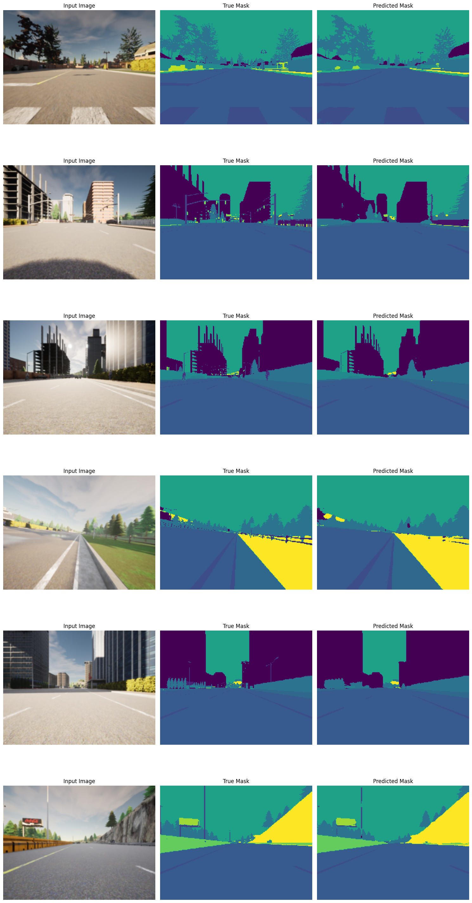
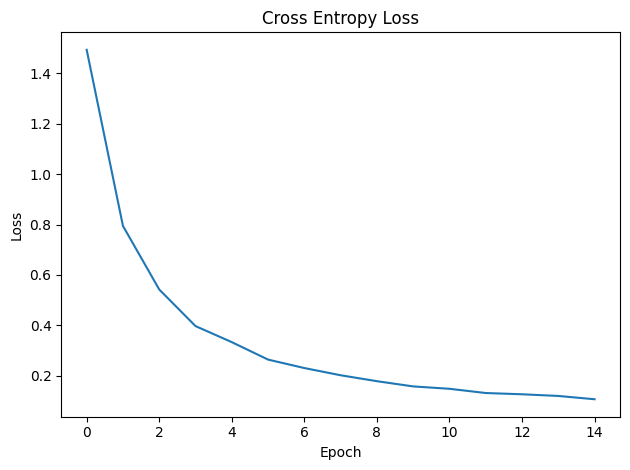

# Semantic Segmentation

We did semantic segmentation task on a dataset used for self-driving cars.

## Model

The first architecture that we used is U-Net. Then we improved it by Attention U-Net.

## Results

By hyperparameter tuning on Attention U-Net model, we approched $\text{mIoU}=0.50$.

Here is the training phase results.

More details on [Semantic_Segmentation notebook](./Semantic_Segmentation.ipynb).
